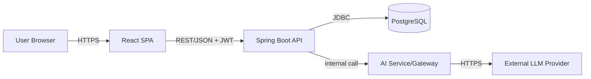
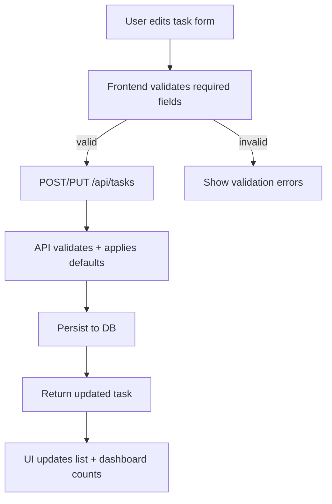
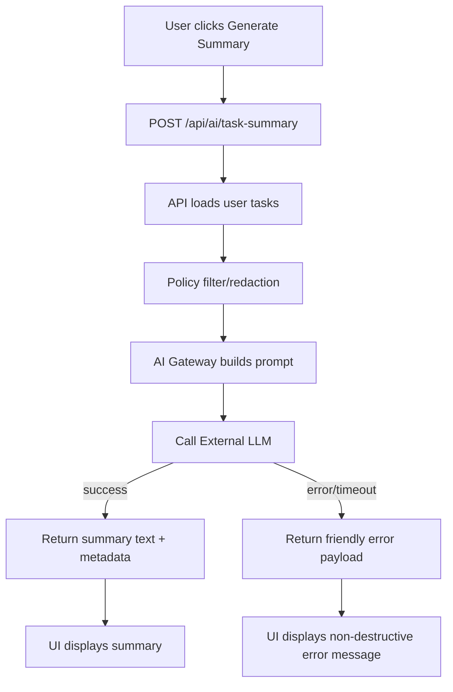

# High-Level Design (HLD) - EPMEDUAI Task Management Application

## Document Metadata

| Field | Value |
|-------|-------|
| Version | 0.1 |
| Date | 2026-07-28 |
| Author | Architecture Assistant |
| Status | Draft |

---

## 1. Executive Summary

EPMEDUAI is a task-management web application. The near-term roadmap includes:

- Task Priority
- Due Date
- Dashboard Statistics
- Dark Mode
- AI-generated Task Summary

This HLD proposes a modern SPA + API design with an optional AI integration behind a privacy boundary and robust error handling.

---

## 2. Goals

- Provide a responsive task app UI with theming, statistics, and task metadata (priority, due dates).
- Add an AI summarization capability over a user’s tasks with graceful degradation.
- Ensure security controls (authentication, RBAC enforcement) and baseline quality (validation, testing).

---

## 3. Scope

### In Scope

- Task CRUD + fields: title, description (optional), status (active/completed), priority (Low/Medium/High), dueDate (optional).
- Dashboard counts: Total/Active/Completed + Overdue/High priority counts.
- Theme toggle persisted locally.
- AI Task Summary: generate natural-language summary for a user’s tasks.
- AuthN/AuthZ (JWT) and RBAC enforcement on API endpoints.

### Out of Scope

- Reminders/notifications, recurring tasks, collaboration/sharing.
- Full-text search and advanced analytics.
- Offline-first sync.

---

## 4. High-Level Architecture Diagram

---

## 5. Logical Components

| Component | Responsibilities |
|-----------|------------------|
| **Web UI (React SPA)** | Task list, forms, dashboard, theme toggle, AI summary view; calls API; local persistence for theme. |
| **API Service (Spring Boot)** | Task CRUD, dashboard stats endpoint, AI summary endpoint; authentication (JWT), RBAC, validation, error handling. |
| **Database (PostgreSQL)** | Persist users and tasks with priority/dueDate fields. |
| **AI Gateway/Service** | Build prompt from task data, call external LLM provider, apply policies (PII redaction), caching. |
| **External LLM Provider** | Managed inference (e.g., OpenAI/Azure OpenAI) accessed via API key in secure storage. |

---

## 6. API Design (Representative)

| Method | Path | Description |
|--------|------|-------------|
| GET | `/api/tasks` | List tasks for current user; supports filters (status, priority, dueBefore) |
| POST | `/api/tasks` | Create task (validates title; sets default priority) |
| PUT | `/api/tasks/{id}` | Update task fields incl. priority/dueDate |
| DELETE | `/api/tasks/{id}` | Delete task |
| GET | `/api/dashboard/stats` | Return counts: total/active/completed (+ optional overdue/highPriority) |
| POST | `/api/ai/task-summary` | Generate summary from user’s tasks (read-only) |

---

## 7. Key Flows

### 7.1 Create/Update Task with Priority and Due Date

### 7.2 AI Task Summary Request

---

## 8. Security & Compliance

- **Authentication**: JWT-based; access tokens stored in httpOnly cookies to reduce XSS risk.
- **Authorization**: RBAC via `@PreAuthorize` on controllers/services; enforce owner checks (`task.userId == principal`).
- **Validation**: Server-side bean validation for user creation and task creation.
- **AI Privacy Boundary**: Only send minimal required task attributes to LLM; redact user-identifying fields.
- **Transport**: HTTPS everywhere; HSTS in production.
- **Secrets**: Stored in environment variables or secret manager.

---

## 9. Reliability & Scaling

- Stateless API instances behind a load balancer; horizontal scaling as needed.
- Database is single writer; add read replicas if necessary later.
- AI requests: timeouts, retries with backoff, circuit breaker, and optional caching per user (TTL: 30–120s).
- Rate limiting for AI endpoint per user to control cost.

---

## 10. Deployment View

| Environment | Purpose | Notes |
|-------------|---------|-------|
| Dev | Local | Docker compose for DB; mocked AI provider |
| Test | CI | Unit + Playwright automation; ephemeral DB |
| Prod | Cloud | SPA served via CDN/static hosting; API on container platform; managed Postgres |

---

## 11. Key Decisions & Tradeoffs

1. **Use Spring Boot + JWT** vs Node: improves alignment with existing backend patterns; tradeoff: Java stack complexity.
2. **AI behind Gateway** vs direct from UI: keeps secrets server-side and enables policy enforcement; tradeoff: extra hop.
3. **Theme stored locally** vs server: simplest and meets story; tradeoff: not shared across devices.
4. **Dashboard stats computed server-side** vs client-only: consistent across devices; tradeoff: extra endpoint.

---

## 12. Risks & Open Questions

- Which backend actually exists in repo? If none, confirm target stack.
- AI provider/policy: what task fields are allowed to be sent?
- Auth token storage strategy in frontend needs decision.
- Timezone rules for due date comparisons must be confirmed.
