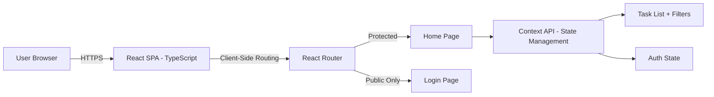
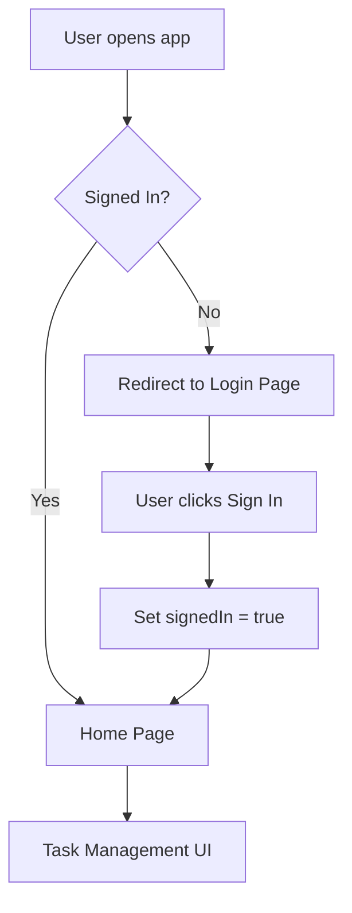
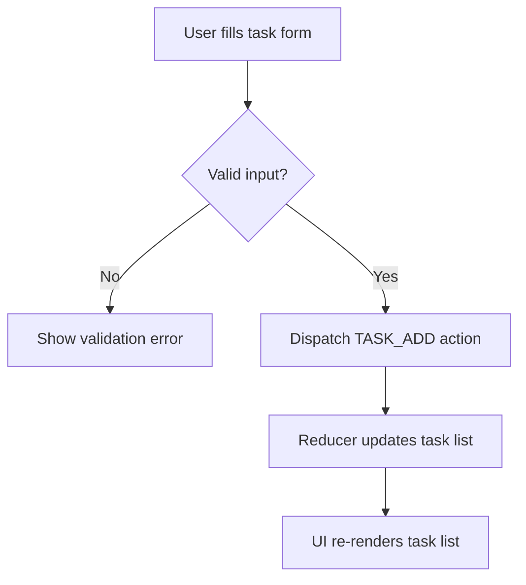
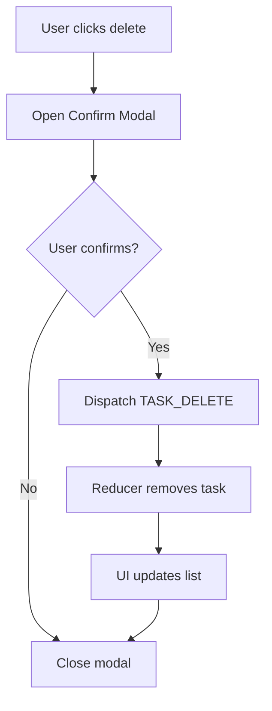
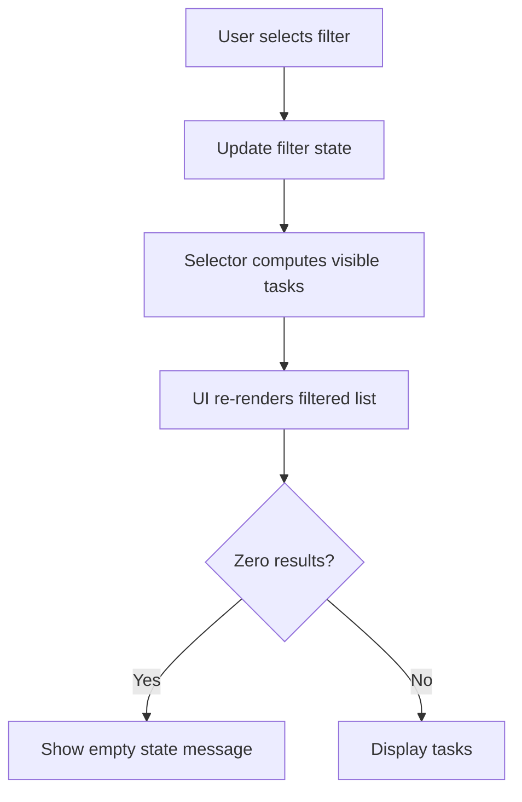

# High-Level Design (HLD) - Task Manager React Application

## Document Metadata

| Field | Value |
|-------|-------|
| Version | 1.0 |
| Date | 2026-07-29 |
| Author | Architecture Assistant |
| Status | Approved |
| Epic | task manager-React (EPMEDUAI) |
| Summary | To do task |

---

## 1. Executive Summary

The Task Manager React application is a front-end Single Page Application (SPA) built with React + TypeScript + Styled Components. It provides:

- Simulated login with client-side route guarding
- Task management: add, mark complete, delete (with confirmation modal)
- Filtering by status (All/Done/Not Done) and by category (sidebar)
- Future roadmap: Task Priority, Due Date, Dashboard Statistics, Dark Mode, AI-generated Task Summary

---

## 2. Goals

- Provide a responsive task app UI with simulated authentication and route protection.
- Enable task CRUD operations (create, toggle completion, delete) with confirmation flows.
- Support filtering by status and category for efficient task management.
- Maintain clean component architecture for testability and extensibility.

---

## 3. Scope

### In Scope

- Login UI with simulated sign-in
- Client-side route guarding (ProtectedRoute / PublicOnlyRoute)
- Task CRUD: title, category, completion status
- Delete task with confirmation modal
- Filtering by status (All/Done/Not Done) and by category
- Responsive layout (desktop + tablet)

### Out of Scope (Current Phase)

- Real authentication and user management
- Backend API and database persistence
- Task editing and category CRUD
- Reminders/notifications, recurring tasks
- Offline-first sync

---

## 4. High-Level Architecture Diagram

---

## 5. Logical Components

| Component | Responsibilities |
|-----------|------------------|
| **Web UI (React SPA)** | Task list, forms, sidebar, filter bar; styled with Styled Components |
| **Routing Layer** | React Router with ProtectedRoute and PublicOnlyRoute guards |
| **State Management** | React Context API for auth, tasks, and filters |
| **Presentation Components** | LoginPage, HomePage, TaskList, TaskItem, AddTaskForm, FilterBar, CategorySidebar, ConfirmModal |
| **Data Layer** | In-memory task store (optional localStorage persistence) |

---

## 6. Core Data Model

### Task Entity

| Field | Type | Notes |
|------|------|-------|
| id | string (UUID) | Primary key |
| title | string | Required, non-empty |
| category | string | Required for filtering |
| completed | boolean | Default: false |
| createdAt | string (ISO) | Optional timestamp |

### Auth Model

| Field | Type | Notes |
|------|------|-------|
| signedIn | boolean | Simulated auth state |

### Filter Model

| Field | Type | Notes |
|------|------|-------|
| status | enum | "ALL" \| "DONE" \| "NOT_DONE" |
| category | string | "ALL" or specific category name |

---

## 7. Key Flows

### 7.1 Login & Route Guard Flow

### 7.2 Add Task Flow

### 7.3 Delete Task with Confirmation

### 7.4 Filtering Flow

---

## 8. Technology Stack

| Layer | Technology |
|-------|------------|
| Language | TypeScript |
| UI Framework | React 18+ |
| Styling | Styled Components |
| Routing | React Router v6 |
| State Management | React Context API + useReducer |
| Build Tool | Create React App (React Scripts) |
| Package Manager | Yarn |
| Testing | Jest + React Testing Library + Playwright |

---

## 9. Security & Constraints

- **Authentication**: Simulated (UI-level only); no real credentials.
- **Route Guards**: Client-side only; not security controls.
- **Data Storage**: In-memory (resets on refresh) unless localStorage is added.
- **No sensitive data** stored in browser.

---

## 10. Deployment View

| Environment | Purpose | Notes |
|-------------|---------|-------|
| Dev | Local | `yarn start` – dev server on localhost:3000 |
| Test | CI | Unit + Playwright automation |
| Prod | Static Hosting | `yarn build` → GitHub Pages / Netlify / Vercel |

---

## 11. Key Decisions & Tradeoffs

1. **React Context API** vs Redux Toolkit: simpler for current scope; tradeoff: may need migration if state grows.
2. **In-memory state** vs localStorage: simplest for study project; tradeoff: data lost on refresh.
3. **Styled Components** vs CSS Modules: aligns with existing repo pattern; tradeoff: runtime CSS-in-JS overhead.
4. **Simulated auth** vs real JWT: meets front-end study scope; tradeoff: no real security.

---

## 12. Risks & Open Questions

- Refresh may reset auth/tasks if no persistence exists.
- Empty/duplicate/very long task names may impact UX/layout.
- Filters may yield zero results; empty-state handling required.
- Modal accessibility (focus handling, keyboard dismiss) may be incomplete.
- Should tasks persist across refresh (e.g., localStorage) or remain in-memory only?
- Is a Sign Out action required?

---

## 13. Future Roadmap (Aligned with Capstone Architecture)

Per the Capstone (CP) Architecture page, future phases may include:

- Task Priority (Low/Medium/High)
- Due Date with overdue indication
- Dashboard Statistics (Total/Active/Completed/Overdue/High Priority)
- Dark Mode toggle (persisted locally)
- AI Task Summary (requires backend integration)
- Spring Boot API + PostgreSQL backend
- JWT authentication & RBAC
