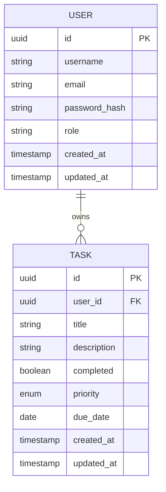
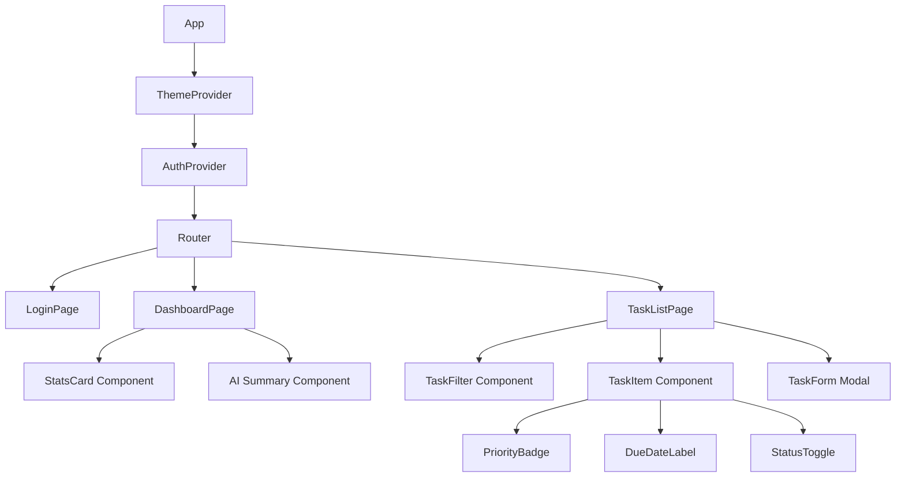
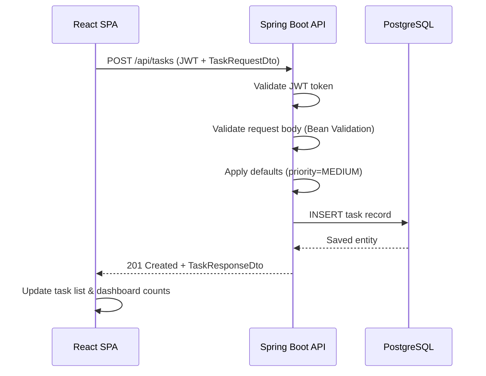
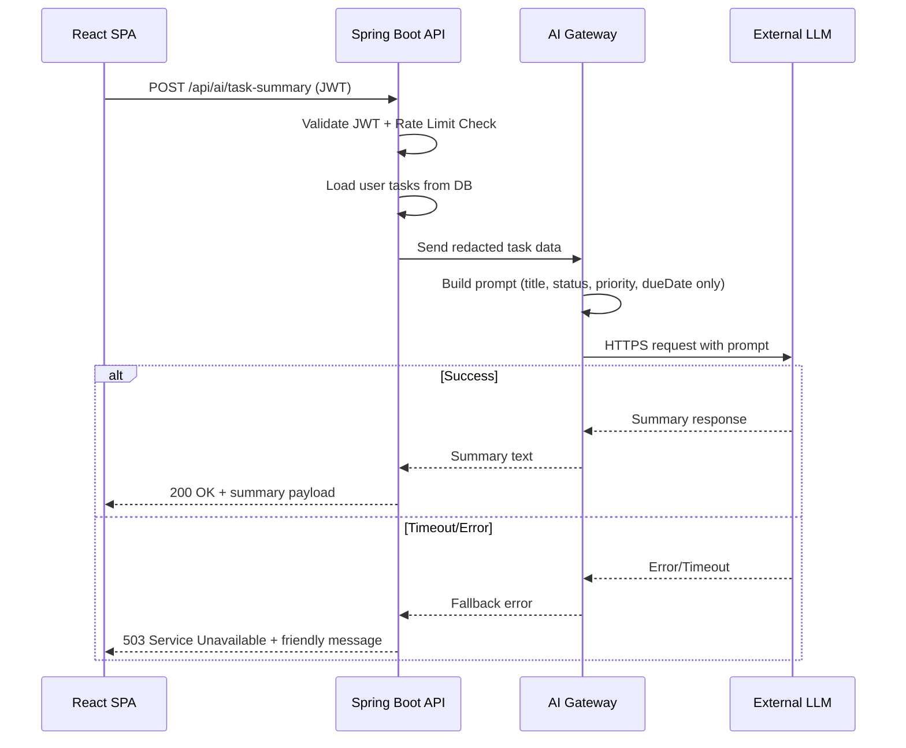
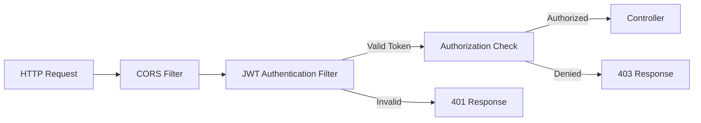

# Low-Level Design (LLD) - EPMEDUAI Task Management Application

## Document Metadata

| Field | Value |
|-------|-------|
| Version | 0.1 |
| Date | 2026-07-28 |
| Author | Architecture Assistant |
| Status | Draft |

---

## 1. Overview

This Low-Level Design document provides detailed component-level design for the EPMEDUAI Task Management Application, covering data models, component hierarchy, service interactions, and implementation details.

---

## 2. Data Model (Entity Relationship Diagram)



---

## 3. Frontend Component Hierarchy



---

## 4. Frontend Component Details

### 4.1 ThemeProvider

| Property | Detail |
|----------|--------|
| State | `theme: 'light' \| 'dark'` |
| Persistence | `localStorage.getItem('theme')` |
| Method | `toggleTheme()` – switches and persists |

### 4.2 TaskForm Component

| Field | Type | Validation |
|-------|------|------------|
| title | text input | Required, max 100 chars |
| description | textarea | Optional, max 500 chars |
| priority | select dropdown | Low/Medium/High; default Medium |
| dueDate | date picker | Optional; must be today or future |

### 4.3 StatsCard Component

Displays dashboard statistics:

```typescript
interface DashboardStats {
  total: number;
  active: number;
  completed: number;
  overdue: number;
  highPriority: number;
}
```

### 4.4 AI Summary Component

| State | Behavior |
|-------|----------|
| Idle | Shows "Generate Summary" button |
| Loading | Shows spinner/skeleton |
| Success | Displays summary text |
| Error | Displays friendly error message with retry button |

---

## 5. Backend Service Layer Design

### 5.1 Package Structure

```
src/main/java/com/epmeduai/
├── controller/
│   ├── TaskController.java
│   ├── DashboardController.java
│   └── AiSummaryController.java
├── service/
│   ├── TaskService.java
│   ├── DashboardService.java
│   └── AiSummaryService.java
├── model/
│   ├── Task.java
│   └── User.java
├── repository/
│   ├── TaskRepository.java
│   └── UserRepository.java
├── dto/
│   ├── TaskRequestDto.java
│   ├── TaskResponseDto.java
│   └── DashboardStatsDto.java
├── security/
│   ├── JwtTokenProvider.java
│   └── SecurityConfig.java
├── ai/
│   ├── AiProvider.java (interface)
│   ├── OpenAiProvider.java
│   └── MockAiProvider.java
└── exception/
    ├── GlobalExceptionHandler.java
    └── ResourceNotFoundException.java
```

### 5.2 Task Entity

```java
@Entity
@Table(name = "tasks")
public class Task {
    @Id
    @GeneratedValue(strategy = GenerationType.UUID)
    private UUID id;

    @Column(nullable = false)
    private UUID userId;

    @NotBlank(size = @Size(max = 100))
    private String title;

    @Size(max = 500)
    private String description;

    private boolean completed = false;

    @Enumerated(EnumType.STRING)
    private Priority priority = Priority.MEDIUM;

    private LocalDate dueDate;

    @CreationTimestamp
    private Instant createdAt;

    @UpdateTimestamp
    private Instant updatedAt;
}

public enum Priority {
    LOW, MEDIUM, HIGH
}
```

### 5.3 Task Service

```java
@Service
public class TaskService {

    public List<TaskResponseDto> getTasksForUser(UUID userId, TaskFilter filter);
    public TaskResponseDto createTask(UUID userId, TaskRequestDto request);
    public TaskResponseDto updateTask(UUID userId, UUID taskId, TaskRequestDto request);
    public void deleteTask(UUID userId, UUID taskId);
}
```

### 5.4 AI Provider Interface

```java
public interface AiProvider {
    String generateTaskSummary(List<TaskSummaryInput> tasks);
}

public record TaskSummaryInput(
    String title,
    boolean completed,
    Priority priority,
    LocalDate dueDate
) {}
```

---

## 6. Sequence Diagrams

### 6.1 Create Task Flow



### 6.2 AI Task Summary Flow



---

## 7. Database Schema (DDL)

```sql
CREATE TABLE users (
    id          UUID PRIMARY KEY DEFAULT gen_random_uuid(),
    username    VARCHAR(50) NOT NULL UNIQUE,
    email       VARCHAR(100) NOT NULL UNIQUE,
    password_hash VARCHAR(255) NOT NULL,
    role        VARCHAR(20) NOT NULL DEFAULT 'USER',
    created_at  TIMESTAMP NOT NULL DEFAULT NOW(),
    updated_at  TIMESTAMP NOT NULL DEFAULT NOW()
);

CREATE TABLE tasks (
    id          UUID PRIMARY KEY DEFAULT gen_random_uuid(),
    user_id     UUID NOT NULL REFERENCES users(id) ON DELETE CASCADE,
    title       VARCHAR(100) NOT NULL,
    description VARCHAR(500),
    completed   BOOLEAN NOT NULL DEFAULT FALSE,
    priority    VARCHAR(10) NOT NULL DEFAULT 'MEDIUM',
    due_date    DATE,
    created_at  TIMESTAMP NOT NULL DEFAULT NOW(),
    updated_at  TIMESTAMP NOT NULL DEFAULT NOW()
);

CREATE INDEX idx_tasks_user_id ON tasks(user_id);
CREATE INDEX idx_tasks_priority ON tasks(priority);
CREATE INDEX idx_tasks_due_date ON tasks(due_date);
```

---

## 8. API Endpoint Detailed Specifications

### 8.1 POST /api/tasks

**Request Body:**

```json
{
  "title": "Complete project report",
  "description": "Finalize Q3 report for management",
  "priority": "HIGH",
  "dueDate": "2026-08-15"
}
```

**Response (201 Created):**

```json
{
  "id": "a1b2c3d4-e5f6-7890-abcd-ef1234567890",
  "title": "Complete project report",
  "description": "Finalize Q3 report for management",
  "completed": false,
  "priority": "HIGH",
  "dueDate": "2026-08-15",
  "createdAt": "2026-07-28T12:00:00Z"
}
```

### 8.2 GET /api/dashboard/stats

**Response (200 OK):**

```json
{
  "total": 25,
  "active": 18,
  "completed": 7,
  "overdue": 3,
  "highPriority": 5
}
```

### 8.3 POST /api/ai/task-summary

**Response (200 OK):**

```json
{
  "summary": "You have 25 tasks. 3 are overdue and 5 are high priority. Consider focusing on...",
  "generatedAt": "2026-07-28T12:00:00Z",
  "tokensUsed": 150
}
```

**Error Response (503):**

```json
{
  "error": "AI_SERVICE_UNAVAILABLE",
  "message": "Unable to generate summary at this time. Please try again later."
}
```

---

## 9. Error Handling Strategy

| HTTP Code | Scenario | Response |
|-----------|-----------|----------|
| 400 | Validation failure | Field-level error messages |
| 401 | Missing/invalid JWT | "Authentication required" |
| 403 | Access denied (not owner) | "You do not have permission" |
| 404 | Task not found | "Task not found" |
| 429 | AI rate limit exceeded | "Please wait before requesting another summary" |
| 503 | AI service unavailable | "Summary service temporarily unavailable" |

---

## 10. Security Implementation Details

### 10.1 JWT Token Structure

```json
{
  "sub": "user-uuid",
  "role": "USER",
  "iat": 1722160000,
  "exp": 1722163600
}
```

### 10.2 Security Filter Chain



---

## 11. Testing Strategy

| Layer | Tool | Coverage Target |
|-------|------|------------------|
| Unit Tests | JUnit 5 + Mockito | > 80% service layer |
| Integration Tests | Spring Boot Test + Testcontainers | API endpoints |
| Frontend Tests | Jest + React Testing Library | Component behavior |
| E2E Tests | Playwright | Critical user flows |

---

## 12. Implementation Readiness Checklist

- [ ] DB migration for `priority` and `due_date` columns
- [ ] Server-side validation (task title, user password) + standardized errors
- [ ] RBAC annotations and ownership checks on all endpoints
- [ ] UI: forms for priority/due date; overdue indicator
- [ ] Dashboard stats component + API hookup
- [ ] Theme provider + persistence
- [ ] AI gateway abstraction + mock provider + graceful error UX
- [ ] Observability: request IDs, metrics, tracing
