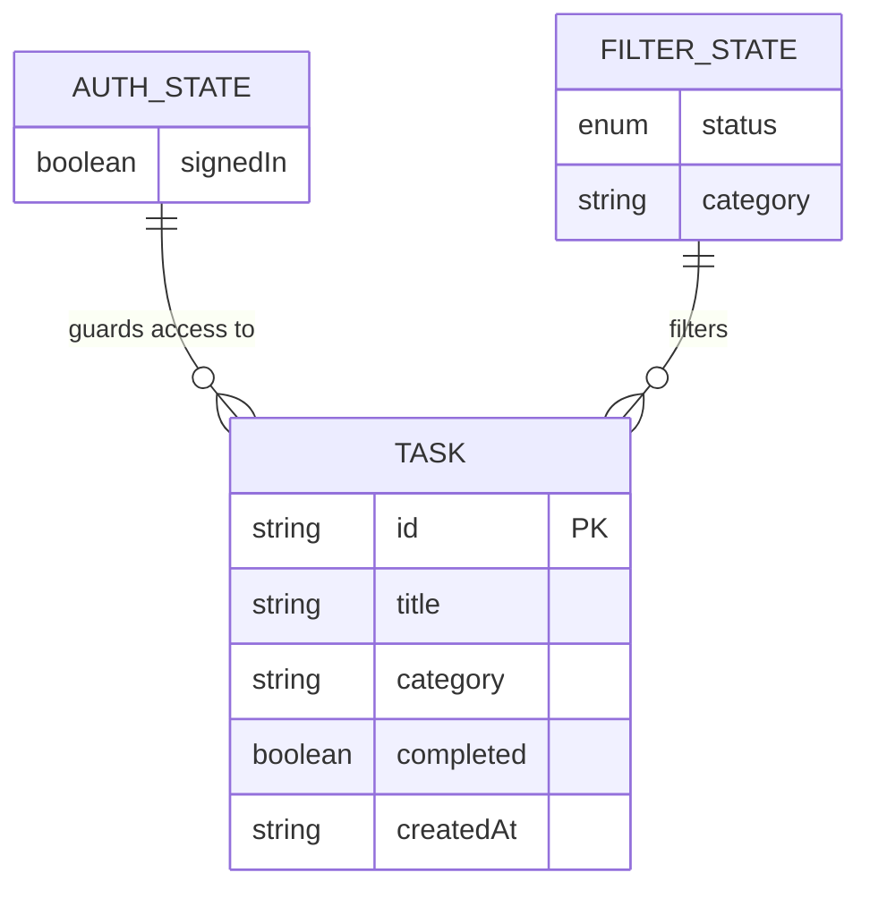
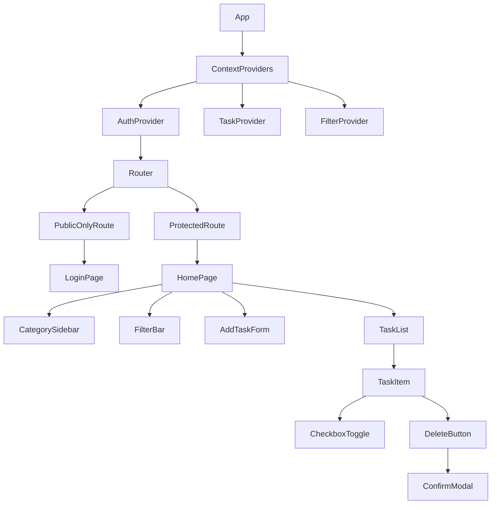
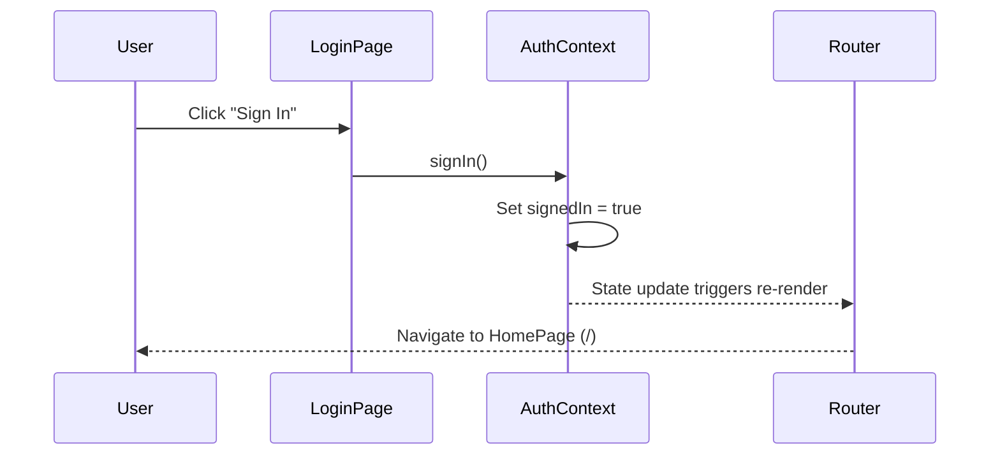
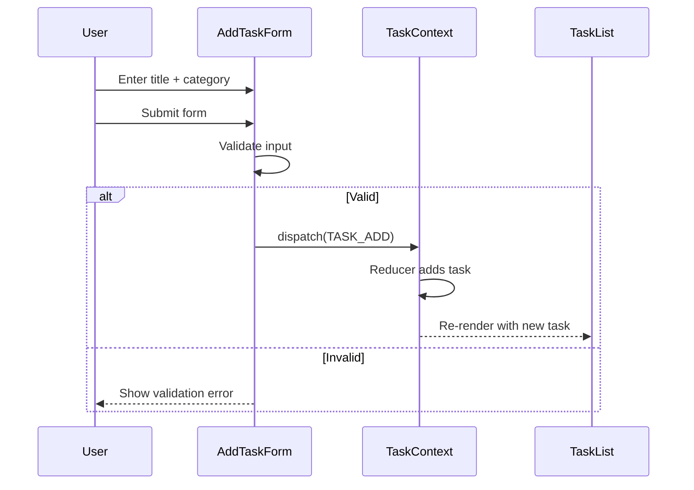
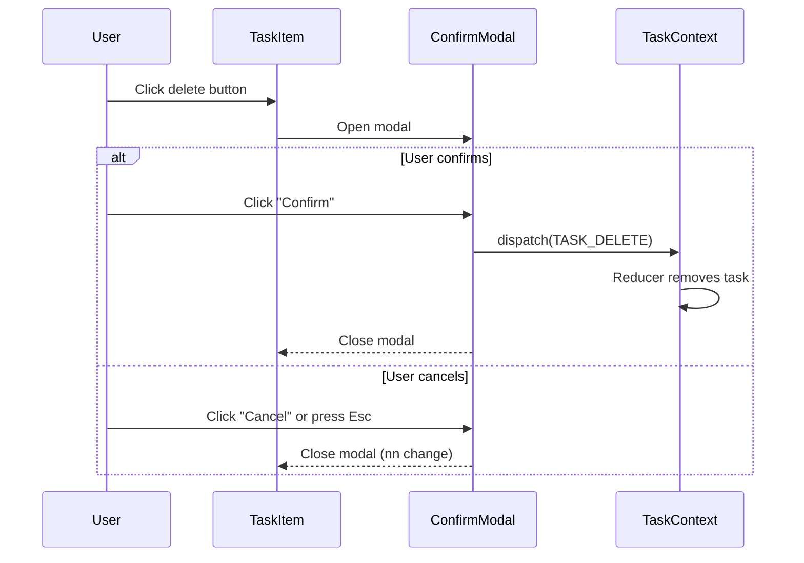
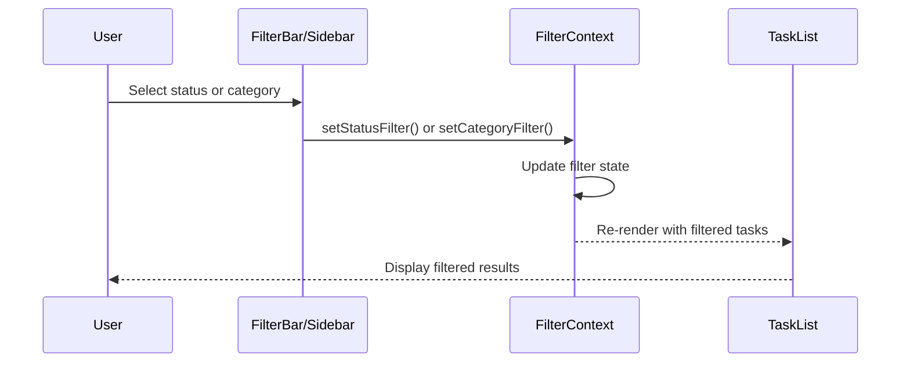

# Low-Level Design (LLD) - Task Manager React Application

## Document Metadata

| Field | Value |
|-------|-------|
| Version | 1.0 |
| Date | 2026-07-29 |
| Author | Architecture Assistant |
| Status | Approved |
| Epic | task manager-React (EPMEDUAI) |
| Summary | To do task |

---

## 1. Overview

This Low-Level Design document provides detailed component-level design for the Task Manager React Application, covering data models, component hierarchy, state management, and implementation details.

---

## 2. Project Structure

```
src/
├── App.tsx                   # Root component with router
├── index.tsx                 # Entry point
├── contextProviders.tsx      # Composed context providers
├── global.ts                 # Global styles
├── Components/                # Reusable UI components
│   ├── TaskList/
│   ├── TaskItem/
│   ├── AddTaskForm/
│   ├── FilterBar/
│   ├── CategorySidebar/
│   └── ConfirmModal/
├── Pages/                    # Page-level components
│   ├── LoginPage/
│   └── HomePage/
├── Contexts/                 # React Context providers
│   ├── AuthContext.tsx
│   ├── TaskContext.tsx
│   └── FilterContext.tsx
├── Routes/                   # Route configuration & guards
│   ├── ProtectedRoute.tsx
│   └── PublicOnlyRoute.tsx
└── Img/                      # Static assets
```

---

## 3. Data Model (Entity Relationship Diagram)



---

## 4. Frontend Component Hierarchy



---

## 5. Component Details

### 5.1 LoginPage

| Property | Detail |
|----------|--------|
| Route | `/login` |
| Guard | PublicOnlyRoute (redirects to `/` if signedIn) |
| Actions | Sign In button → sets `signedIn = true` → navigate to `/` |
| Styling | Centered card with app logo |

### 5.2 HomePage

| Property | Detail |
|----------|--------|
| Route | `/` |
| Guard | ProtectedRoute (redirects to `/login` if not signedIn) |
| Layout | Sidebar (categories) + Main content (task list) |
| Children | CategorySidebar, FilterBar, AddTaskForm, TaskList |

### 5.3 AddTaskForm

| Field | Type | Validation |
|-------|------|------------|
| title | text input | Required, non-empty, trimmed |
| category | select dropdown / text | Required |

### 5.4 TaskItem

| Element | Behavior |
|---------|----------|
| Checkbox | Toggles `completed` status |
| Title | Strikethrough when completed |
| Category Badge | Displays category label |
| Delete Button | Opens ConfirmModal |

### 5.5 FilterBar

| Filter | Options |
|--------|---------|
| Status | All / Done / Not Done |

### 5.6 CategorySidebar

| Property | Detail |
|----------|--------|
| Data Source | Derived from unique categories in task list |
| Behavior | Click category → updates filter state |
| "All" Option | Resets category filter |

### 5.7 ConfirmModal

| Property | Detail |
|----------|--------|
| Trigger | Delete button on TaskItem |
| Content | "Are you sure you want to delete this task?" |
| Actions | Confirm (deletes task) / Cancel (closes modal) |
| Accessibility | Focus trap, Escape to close, aria-modal |

---

## 6. State Management Design

### 6.1 AuthContext

```typescript
interface AuthState {
  signedIn: boolean;
}

interface AuthContextValue {
  state: AuthState;
  signIn: () => void;
  signOut: () => void; // optional
}
```

### 6.2 TaskContext

```typescript
interface Task {
  id: string;
  title: string;
  category: string;
  completed: boolean;
  createdAt: string;
}

type TaskAction =
  | { type: 'TASK_ADD'; payload: Omit<Task, 'id' | 'createdAt'> }
  | { type: 'TASK_TOGGLE'; payload: { id: string } }
  | { type: 'TASK_DELETE'; payload: { id: string } };

interface TaskContextValue {
  tasks: Task[];
  dispatch: React.Dispatch<TaskAction>;
}
```

### 6.3 FilterContext

```typescript
type StatusFilter = 'ALL' | 'DONE' | 'NOT_DONE';

interface FilterState {
  status: StatusFilter;
  category: string; // 'ALL' or specific category
}

interface FilterContextValue {
  filters: FilterState;
  setStatusFilter: (status: StatusFilter) => void;
  setCategoryFilter: (category: string) => void;
}
```

### 6.4 Task Reducer Logic

```typescript
function taskReducer(state: Task[], action: TaskAction): Task[] {
  switch (action.type) {
    case 'TASK_ADD':
      return [...state, {
        ...action.payload,
        id: crypto.randomUUID(),
        completed: false,
        createdAt: new Date().toISOString(),
      }];
    case 'TASK_TOGGLE':
      return state.map(task =>
        task.id === action.payload.id
          ? { ...task, completed: !task.completed }
          : task
      );
    case 'TASK_DELETE':
      return state.filter(task => task.id !== action.payload.id);
    default:
      return state;
  }
}
```

### 6.5 Filtered Tasks Selector

```typescript
function getFilteredTasks(tasks: Task[], filters: FilterState): Task[] {
  return tasks.filter(task => {
    const matchesStatus =
      filters.status === 'ALL' ||
      (filters.status === 'DONE' && task.completed) ||
      (filters.status === 'NOT_DONE' && !task.completed);
    const matchesCategory =
      filters.category === 'ALL' || task.category === filters.category;
    return matchesStatus && matchesCategory;
  });
}
```

---

## 7. Sequence Diagrams

### 7.1 Sign In Flow



### 7.2 Add Task Flow



### 7.3 Delete Task with Confirmation



### 7.4 Filtering Flow



---

## 8. Routing Configuration

```typescript
// App.tsx
const App = () => (
  <BrowserRouter>
    <Routes>
      <Route path="/login" element={<PublicOnlyRoute><LoginPage /></PublicOnlyRoute>} />
      <Route path="/" element={<ProtectedRoute><HomePage /></ProtectedRoute>} />
    </Routes>
  </BrowserRouter>
);
// ProtectedRoute.tsx
const ProtectedRoute = ({ children }) => {
  const { state } = useAuth();
  return state.signedIn ? children : <Navigate to="/login" />;
};

// PublicOnlyRoute.tsx
const PublicOnlyRoute = ({ children }) => {
  const { state } = useAuth();
  return !state.signedIn ? children : <Navigate to="/" />;
};
```

---

## 9. Styling Approach

| Aspect | Approach |
|--------|----------|
| Library | Styled Components |
| Global Styles | `createGlobalStyle` in `global.ts` |
| Theming | ThemeProvider (future dark mode) |
| Responsive | Media queries for tablet/desktop |
| Component Styles | Co-located `styles.ts` per component folder |

---

## 10. Error Handling & Edge Cases

| Scenario | Handling |
|----------|----------|
| Empty task title | Inline validation message; prevent submit |
| Missing category | Inline validation message; prevent submit |
| Zero filtered results | Empty state UI ("No tasks found") |
| Delete last task | Show empty state after deletion |
| Browser refresh | State resets (in-memory); optional localStorage |
| Modal accessibility | Focus trap, Escape to close, aria attributes |

---

## 11. Testing Strategy

| Layer | Tool | Coverage Target |
|-------|------|------------------|
| Unit Tests | Jest + React Testing Library | Reducers, utilities, component behavior |
| Integration Tests | React Testing Library | Page-level flows with context |
| E2E Tests | Playwright | Login redirect, add/toggle/delete, filtering |

---

## 12. Implementation Readiness Checklist

- [ ] AuthContext with signIn action
- [ ] ProtectedRoute and PublicOnlyRoute guards
- [ ] LoginPage with Sign In button
- [ ] TaskContext with reducer (ADD/TOGGLE/DELETE)
- [ ] AddTaskForm with validation
- [ ] TaskList + TaskItem components
- [ ] ConfirmModal for delete
- [ ] FilterBar (status) + CategorySidebar
- [ ] FilterContext with combined filtering logic
- [ ] Empty state UI for zero results
- [ ] Unit tests for reducers and filter logic
- [ ] Playwright E2E tests for critical flows
