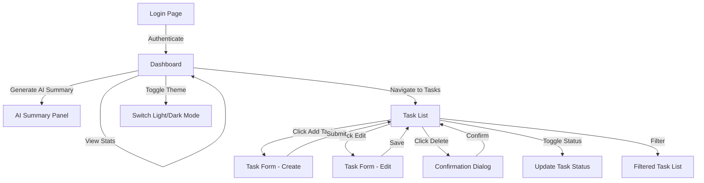

# Wireframes - EPMEDUAI Task Management Application

## Document Metadata

| Field | Value |
|-------|-------|
| Version | 0.1 |
| Date | 2026-07-28 |
| Author | Architecture Assistant |
| Status | Draft |

---

## 1. Overview

This document provides wireframe representations for the key screens of the EPMEDUAI Task Management Application. Each wireframe describes the layout, components, and user interactions for each screen.

---

## 2. Screen Inventory

| # | Screen | Description |
|---|--------|-------------|
| 1 | Login Page | User authentication |
| 2 | Dashboard | Statistics overview + AI summary |
| 3 | Task List | Main task management view |
| 4 | Task Form (Create/Edit) | Modal for task creation/editing |
| 5 | Dark Mode Variant | Theme toggle demonstration |

---

## 3. Wireframe 1: Login Page

```
┌────────────────────────────────────────────────�
│                                                │
│                 📋 EPMEDUAI Tasks                │
│                                                │
│     ┌────────────────────────────────�     │
│     │                                       │     │
│     │   Username                           │     │
│     │   ┌──────────────────────────�   │     │
│     │   │                                │   │     │
│     │   └──────────────────────────┘   │     │
│     │                                        │     │
│     │   Password                             │     │
│     │   ┌──────────────────────────�   │     │
│     │   │  ••••••••                   │   │     │
│     │   └──────────────────────────┘   │     │
│     │                                        │     │
│     │   ┌──────────────────────────�   │     │
│     │   │          LOG IN             │   │     │
│     │   └──────────────────────────┘   │     │
│     │                                       │     │
│     └────────────────────────────────┘     │
│                                              │
└────────────────────────────────────────────────┘
```

**Components:**
- App logo and title
- Username input field
- Password input field (masked)
- Login button (primary action)

---

## 4. Wireframe 2: Dashboard

```
┌────────────────────────────────────────────────────────────�
│  [Home]  [Tasks]                                      [🌙] [Logout]  │
├────────────────────────────────────────────────────────────┤
│                                                                  │
│   Dashboard                                                     │
│                                                                   │
│   ┌──────────� ┌──────────� ┌───────────� ┌──────────� ┌───────────�  │
│   │  Total    │ │  Active   │ │ Completed │ │  Overdue  │ │ High Prio  │  │
│   │    25     │ │    18    │ │     7     │ │     3     │ │     5      │  │
│   └──────────┘ └──────────┘ └───────────┘ └──────────┘ └───────────┘  │
│                                                                   │
│   ┌───────────────────────────────────────────────────────�  │
│   │                                                              │  │
│   │   🤖 AI Task Summary                                            │  │
│   │                                                              │  │
│   │   You have 25 tasks. 3 are overdue and 5 are high          │  │
│   │   priority. Consider focusing on the overdue items       │  │
│   │   first, especially the high-priority ones.               │  │
│   │                                                               │  │
│   │   ┌──────────────────────�                                 │  │
│   │   │ Generate New Summary   │                                 │  │
│   │   └──────────────────────┘                                 │  │
│   │                                                               │  │
│   └───────────────────────────────────────────────────────┘  │
│                                                                   │
└────────────────────────────────────────────────────────────┘
```

**Components:**
- **Navigation Bar**: Home, Tasks links + Theme toggle (🌙) + Logout
- **Statistics Cards**: 5 cards showing Total, Active, Completed, Overdue, High Priority counts
- **AI Summary Panel**: Displays generated summary text + "Generate New Summary" button

---

## 5. Wireframe 3: Task List

```
┌────────────────────────────────────────────────────────────�
│  [Home]  [Tasks]                                      [🌙] [Logout]  │
├────────────────────────────────────────────────────────────┤
│                                                                  │
│   My Tasks                                       [+ Add Task]   │
│                                                                   │
│   Filter: [All v]  Priority: [All v]  Status: [All v]           │
│                                                                    │
│   ┌───────────────────────────────────────────────────────�  │
│   │  â˜�  Complete project report          [HIGH]  Due: Aug 15  âœ� ð——• │  │
│   ├───────────────────────────────────────────────────────┤  │
│   │  â˜�  Buy groceries                    [LOW]   Due: Jul 30  âœ� ð——• │  │
│   │                                                🔴 OVERDUE     │  │
│   ├───────────────────────────────────────────────────────┤  │
│   │  ✓  Read documentation              [MED]                âœ�ð——• │  │
│   │                                                              │  │
│   ├───────────────────────────────────────────────────────┤  │
│   │  â˜�  Setup CI/CD pipeline            [HIGH]  Due: Aug 01  âœ�ð——• │  │
│   └───────────────────────────────────────────────────────┘  │
│                                                                  │
│   Legend:  â˜� = Active  ✓ = Completed  âœ� = Edit  ð——• = Delete             │
│             🔴 = Overdue indicator                                     │
└────────────────────────────────────────────────────────────┘
```

**Components:**
- **Navigation Bar**: Same as dashboard
- **Page Title**: "My Tasks" + "Add Task" button
- **Filter Bar**: Dropdowns for filtering by priority and status
- **Task List Items**: Each item shows:
  - Status indicator (� active / ✓ completed)
  - Task title
  - Priority badge (HIGH/MED/LOW)
  - Due date (if set)
  - Overdue indicator (🔴) when past due
  - Edit (�) and Delete (🗕) actions

---

## 6. Wireframe 4: Task Form (Create/Edit Modal)

```
┌────────────────────────────────────────�
│                                        │
│   Create New Task                      [x]  │
│                                          │
│   Title *                                │
│   ┌─────────────────────────────────�  │
│   │                                     │  │
│   └─────────────────────────────────┘  │
│                                          │
│   Description (optional)                   │
│   ┌─────────────────────────────────�  │
│   │                                      │  │
│   │                                       │  │
│   └─────────────────────────────────┘  │
│                                          │
│   Priority               Due Date          │
│   ┌─────────────�   ┌─────────────�  │
│   │  Medium    v  │   │  yyyy-mm-dd  │  │
│   └─────────────┘   └─────────────┘  │
│                                          │
│   ┌──────────────�  ┌──────────────�  │
│   │    Cancel     │  │  Create Task  │  │
│   └──────────────┘  └──────────────┘  │
│                                          │
└────────────────────────────────────────┘
```

**Components:**
- **Modal Header**: "Create New Task" / "Edit Task" + close button
- **Title Field**: Required text input (max 100 chars)
- **Description Field**: Optional textarea (max 500 chars)
- **Priority Dropdown**: Low/Medium/High (default: Medium)
- **Due Date Picker**: Optional date selection
- **Action Buttons**: Cancel (secondary) + Create/Save (primary)

---

## 7. Wireframe 5: Dark Mode Variant

```
┌────────────────────────────────────────────────────────────�
│  Background: #1E1E2E                                                 │
│────────────────────────────────────────────────────────────┤
│  [Home]  [Tasks]                                      [☀�] [Logout]  │
├────────────────────────────────────────────────────────────┤
│                                                                  │
│   Text: #FFFFFF                                                  │
│   Cards: #2D2D44                                                  │
│   Accent: #6C72CB                                                  │
│   Borders: #3D3D5C                                                 │
│                                                                    │
│   ┌──────────� ┌──────────� ┌───────────� ┌──────────� ┌───────────�  │
│   │  Total    │ │  Active   │ │ Completed │ │  Overdue  │ │ High Prio  │  │
│   │    25     │ │    18    │ │     7     │ │     3     │ │     5      │  │
│   └──────────┘ └──────────┘ └───────────┘ └──────────┘ └───────────┘  │
│   (Cards use #2D2D44 background with #FFFFFF text)                   │
│                                                                    │
└────────────────────────────────────────────────────────────┘
```

**Dark Mode Design Tokens:**

| Element | Light Mode | Dark Mode |
|---------|------------|-----------|
| Background | #FEFEGE | #1E1E2E |
| Card Background | #FFFFFF | #2D2D44 |
| Text Primary | #1A1A1A | #FFFFFF |
| Text Secondary | #6B7280 | #A0AEB8 |
| Accent/Primary | #4A90E2 | #6C72CB |
| Border | #E2E8F0 | #3D3D5C |
| Danger (Overdue) | #EF4444 | #FF6B6B |
| Success (Completed) | #22C55E | #4ADE80 |

---

## 8. User Flow Diagram



---

## 9. Responsive Behavior

| Breakpoint | Layout Changes |
|------------|----------------|
| Desktop (>1024px) | Full layout with side-by-side stats cards |
| Tablet (768-1024px) | Stats cards wrap to 2 rows; task list full width |
| Mobile (<768px) | Single column; stats stack vertically; hamburger nav |

---

## 10. Interaction Notes

| Interaction | Behavior |
|-------------|----------|
| Task status toggle | Click checkbox → immediate API call + optimistic UI update |
| Delete task | Confirmation dialog before deletion |
| Form validation | Real-time validation on blur; disable submit if invalid |
| AI summary | Loading state with skeleton; error state with retry |
| Theme toggle | Instant switch with CSS transition; persist to localStorage |
| Overdue indicator | Automatically shown when dueDate < today && !completed |
