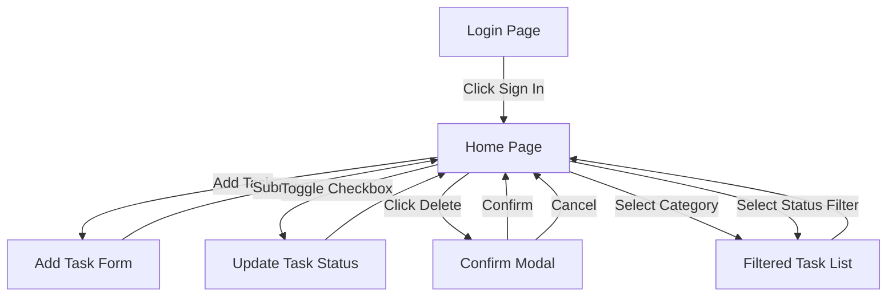

# Wireframes - Task Manager React Application

## Document Metadata

| Field | Value |
|-------|-------|
| Version | 1.0 |
| Date | 2026-07-29 |
| Author | Architecture Assistant |
| Status | Approved |
| Epic | task manager-React (EPMEDUAI) |
| Summary | To do task |

---

## 1. Overview

This document provides wireframe representations for the key screens of the Task Manager React Application. Each wireframe describes the layout, components, and user interactions for each screen.

---

## 2. Screen Inventory

| # | Screen | Description |
|---|--------|-------------|
| 1 | Login Page | Simulated user authentication |
| 2 | Home Page | Main task management view with sidebar + task list |
| 3 | Add Task Form | Inline form for task creation |
| 4 | Confirm Delete Modal | Confirmation dialog before deletion |
| 5 | Empty State | Zero tasks / zero filtered results |

---

## 3. Wireframe 1: Login Page

```
┌────────────────────────────────────────────────┐
│                                                │
│                 📋 Task Manager                │
│                                                 │
│     ┌──────────────────────────────────┐     │
│     │                                        │     │
│     │   Welcome back!                      │     │
│     │                                        │     │
│     │   ┌────────────────────────────┐   │     │
│     │   │        SIGN IN             │   │     │
│     │   └────────────────────────────┘    │     │
│     │                                        │     │
│     └──────────────────────────────────┘     │
│                                                │
└────────────────────────────────────────────────┘
```

**Components:**
- App logo and title (📋 Task Manager)
- Welcome message
- Sign In button (primary action)
- No username/password fields (simulated auth)

**Behavior:**
- Click "Sign In" → sets auth state → redirects to Home Page
- If already signed in, redirects to Home automatically

---

## 4. Wireframe 2: Home Page (Main Task View)

```
┌────────────────────────────────────────────────────────────┐
│  SIDEBAR             |  MAIN CONTENT                                     │
├────────────────────────────────────────────────────────────┤
│  Categories         |  My Tasks                                         │
│                     |                                                   │
│  [▽] All            |  Filter: [All v] [Done v] [Not Done v]           │
│  [ ] Work           |                                                    │
│  [ ] Personal       |  Add New Task:                                    │
│  [ ] Shopping       |  ┌──────────────────────┐ ┌───────────┐ ┌───────┐    │
│  [ ] Study         |  │ Task name...            │ │ Category v │ │ Add  │    │
│                     |  └──────────────────────┘ └───────────┘ └───────┘    │
│                   |                                                    │
│                    |  ┌───────────────────────────────────────────┐   │
│                    |  │  ☐  Buy groceries          [Shopping]    🗑   │   │
│                    |  ├───────────────────────────────────────────┤   │
│                    |  │  ✓  Read documentation    [Study]       🗑   │   │
│                    |  ├───────────────────────────────────────────┤   │
│                    |  │  ☐  Setup CI/CD pipeline   [Work]        🗑   │   │
│                    |  └───────────────────────────────────────────┘   │
│                    |                                                    │
│                    |  Leatend:  ☐ = Active  ✓ = Completed  🗑 = Delete     │
└────────────────────────────────────────────────────────────┘
```

**Components:**
- **Sidebar (CategorySidebar)**: Lists all categories derived from tasks; "All" option resets filter
- **Filter Bar**: Status filter buttons (All / Done / Not Done)
- **Add Task Form**: Inline form with task name input + category dropdown + Add button
- **Task List**: Each item shows:
  - Status indicator (☐ active / ✓ completed)
  - Task title (strikethrough when completed)
  - Category badge
  - Delete button (🗑)

---

## 5. Wireframe 3: Confirm Delete Modal

```
┌────────────────────────────────────────┐
│                                          │
│   Delete Task                         [x]  │
│                                          │
│   Are you sure you want to delete          │
│   this task?                              │
│                                          │
│   "Task title here"                       │
│                                          │
│   ┌──────────────┐  ┌──────────────┐   │
│   │    Cancel     │  │    Delete    │   │
│   └──────────────┘  └──────────────┘   │
│                                          │
└────────────────────────────────────────┘
```

**Components:**
- **Modal Header**: "Delete Task" + close button (x)
- **Confirmation Message**: "Are you sure you want to delete this task?"
- **Task Title**: Displays the task being deleted
- **Action Buttons**: Cancel (secondary) + Delete (danger/primary)

**Behavior:**
- Click "Delete" → removes task from list
- Click "Cancel" or press Escape → closes modal, no change
- Focus trapped inside modal
- Backdrop click closes modal

---

## 6. Wireframe 4: Empty State

```
┌────────────────────────────────────────────────────────────┐
│  SIDEBAR             |  MAIN CONTENT                                     │
├────────────────────────────────────────────────────────────┤
│  Categories         |  My Tasks                                         │
│                     |                                                    │
│  [▽] All            |  Filter: [All v]                                   │
│                     |                                                    │
│                     |                                                    │
│                     |             📝                                     │
│                     |         No tasks found.                           │
│                     |      Add your first task above!                   │
│                     |                                                    │
└────────────────────────────────────────────────────────────┘
```

**Behavior:**
- Shown when task list is empty (no, tasks added yet)
- Shown when filters yield zero results (message adjusts: "No tasks match your filters.")

---

## 7. User Flow Diagram



---

## 8. Responsive Behavior

| Breakpoint | Layout Changes |
|------------|----------------|
| Desktop (>1024px) | Sidebar + main content side by side |
| Tablet (768-1024px) | Sidebar collapses to top bar; task list full width |
| Mobile (<768px) | Single column; sidebar as dropdown; stacked layout |

---

## 9. Interaction Notes

| Interaction | Behavior |
|-------------|----------|
| Task status toggle | Click checkbox → immediate state update; visual strikethrough |
| Delete task | Confirmation modal before deletion |
| Add task validation | Real-time validation; disable submit if invalid |
| Category selection | Highlight active category in sidebar |
| Status filter | Highlight active filter button |
| Combined filters | Both status AND category applied simultaneously |
| Empty state | Friendly message when no tasks match |
| Keyboard navigation | Tab through interactive elements; Enter/Space to activate |

---

## 10. Accessibility Requirements

| Element | Requirement |
|---------|-------------|
| Confirm Modal | `aria-modal="true"`, focus trap, Escape to close |
| Checkbox | `aria-label` with task title |
| Delete button | `aria-label="Delete [task title]"` |
| Filter buttons | `aria-pressed` for active state |
| Sidebar nav | `role="navigation"` with `aria-label` |
| Form inputs | Associated `<label>` elements |

---

## 11. Design Tokens (Styling Guide)

| Element | Value |
|---------|-------|
| Primary Color | #4A90E2 (buttons, active states) |
| Danger Color | #EF4444 (delete button) |
| Success Color | #22C55E (completed indicator) |
| Background | #F9FAFB |
| Card Background | #FFFFFF |
| Text Primary | #1A1A1A |
| Text Secondary | #6B7280 |
| Border | #E2E8F0 |
| Font Family | Inter, sans-serif |
| Border Radius | 8px (cards), 4px (buttons/inputs) |
| Spacing Unit | 8px base |
